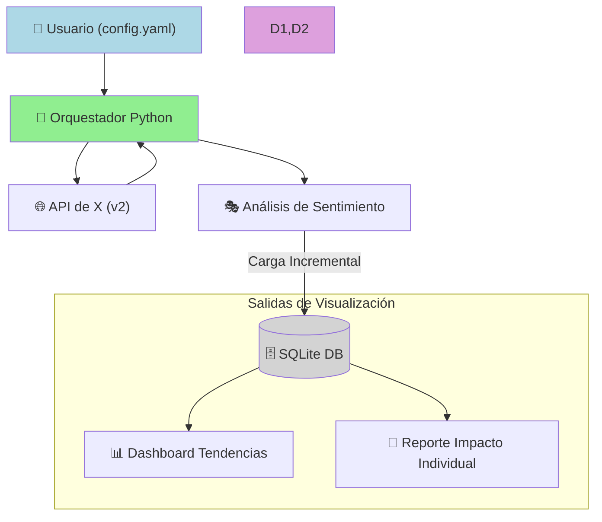

📊 ARQUITECTURA-DE-SOLUCIONES: Análisis de Sentimientos X
Materia: Arquitectura de Soluciones

Alumnos: Facundo Zubeldia - Gonzalo Martín González Nastovich

1. Objetivo del Proyecto
Desarrollar un flujo de datos (Pipeline) dinámico y automático para monitorear la percepción pública en la plataforma X. La solución permite tanto el seguimiento de tendencias masivas por palabras clave como el análisis de impacto detallado de publicaciones individuales y sus respectivas respuestas (replies).

2. Componentes de la Arquitectura
🏗️ Capas del Sistema
Ingesta (ETL): Scripts en Python que extraen datos mediante la API v2 de X, manejando autenticación por Bearer Token. Se han desarrollado dos puntos de entrada: masivo y unitario.

Procesamiento: Clasificación de sentimientos (Positivo, Neutro, Negativo) y estructuración de datos en tiempo real.

Persistencia: Base de datos relacional SQLite (data/sentimientos.db) que asegura la integridad, evita duplicidad de registros y permite el almacenamiento de los textos originales para auditoría.

Visualización (BI): Dashboards interactivos desarrollados en Streamlit utilizando gráficos de Plotly.

🚀 Guía de Ejecución
1. Preparación del Entorno
# Crear y activar entorno virtual
python -m venv .venv
source .venv/bin/activate  # En Linux/Pop!_OS
.\.venv\Scripts\activate   # En Windows

# Instalación de dependencias
pip install -r requirements.txt

# Configurar credenciales (Variable de entorno)
export X_BEARER_TOKEN="tu_token_aqui" # Linux
# $env:X_BEARER_TOKEN="tu_token_aqui" # Windows PowerShell

2. Modo: Tendencias Masivas (Búsqueda por Tema)
Analiza el volumen general de una búsqueda configurada en config.yaml bajo la sección analisis_masivo.

Ejecutar Ingesta: python src/main.py

Ver Dashboard: streamlit run src/visualizacion.py

3. Modo: Impacto Unitario (Análisis de Post Específico)
Analiza un Tweet determinado y la reacción (comentarios) de la audiencia. Se configura en config.yaml bajo analisis_unitario.

Ejecutar Ingesta: python src/main_unitario.py

Ver Reporte Detallado: streamlit run src/detalle_tweet.py

⚖️ Marco Legal y Ético
La solución garantiza la privacidad y cumple con la Ley 25.326 de Protección de Datos Personales (Argentina) mediante:

Disociación de datos: Eliminación de nombres reales y perfiles identificables.

Anonimización: Almacenamiento de metadatos de opinión con fines estrictamente estadísticos.

Finalidad Específica: Uso de datos públicos para el análisis del clima social solicitado.

📁 Estructura del Repositorio
src/main.py / src/main_unitario.py: Motores de extracción.

src/visualizacion.py / src/detalle_tweet.py: Aplicaciones de visualización.

src/config.yaml: Archivo centralizado de configuración de parámetros.

data/: Almacenamiento local (excluido por .gitignore).

Desarrollado para la Technicatura Superior en Ciencia de Datos e IA - ISTEA.

Notas para la entrega:
Requerimientos: Asegúrate de que tu requirements.txt esté actualizado (puedes generarlo con pip freeze > requirements.txt).

Config: Recuerda que el config.yaml ahora debe tener las dos secciones (analisis_masivo y analisis_unitario) para que ambos scripts funcionen.
